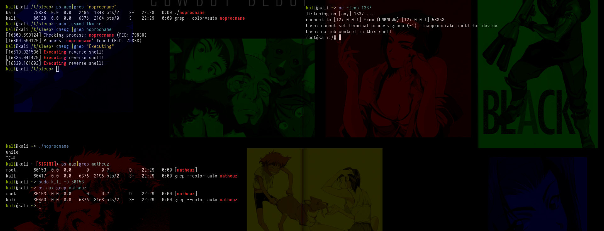

# KThreadShell
Persistent Reverse Shell with Kernel Thread Monitoring and Uninterruptible Sleep

this LKM creates a thread that periodically checks if the noprocname process is active. If it does not find noprocname, it executes a command to create a reverse shell. This reverse shell is kept active through a sleep set to 5 seconds. Executing the command to create the reverse shell is done through the call_usermodehelper function, which is used to execute a command in user space.

Of course, I used reverse shell just for an example, you can do other things with it, like run an ELF, run commands, etc.

In addition, you can come to if (strncmp(task->comm, "noprocname", 10) == 0 && task->comm[10] == '\0') {, and change it to another name too. (If you are going to change the name, remember that it needs to have the same number of chars, in this case procname has 10)

### Join in Rootkit Researchers Group

https://discord.gg/66N5ZQppU7
